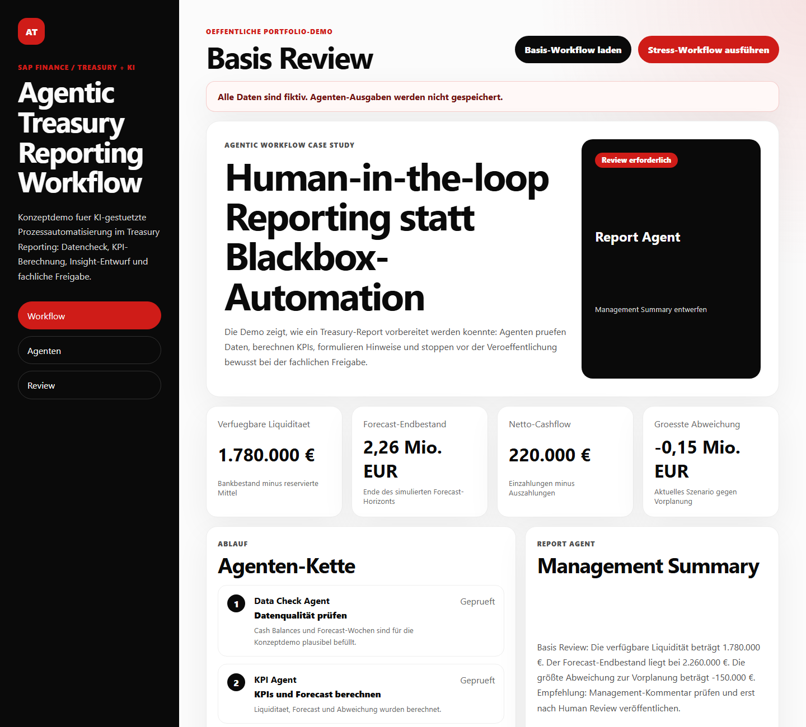

# Agentic Treasury Reporting Workflow

Deutschsprachige Portfolio-Demo fuer SAP Finance / Treasury Consulting mit KI-Bezug.

Die Anwendung zeigt einen kontrollierten agentic Workflow fuer Treasury Reporting: synthetische Cash- und Forecast-Daten werden von mehreren konzeptionellen Agenten geprueft, berechnet, kommentiert und anschliessend bewusst in einen Human Review gegeben. Das Projekt ist als dritte Case Study im GitHub-Portfolio gedacht und ergaenzt:

- `working-capital-cash-cockpit`: Forderungsmanagement, DSO, Cashflow-Wirkung.
- `treasury-cash-position-cockpit`: Cash Position, Bankbestaende, Forecast und Management Reporting.
- `agentic-treasury-reporting-workflow`: KI-/Agentenprozess fuer Reporting-Automatisierung mit fachlicher Kontrolle.

## Live Demo

Geplante GitHub-Pages-URL:

`https://hundrei.github.io/agentic-treasury-reporting-workflow/`

## Vorschau



## Fachliches Problem

Treasury- und Finance-Teams muessen regelmaessig Cash Reports vorbereiten: Bankbestaende pruefen, Forecast-Abweichungen erkennen, Risiken priorisieren und Management-Kommentare formulieren. Genau dort kann KI helfen, ohne die fachliche Verantwortung zu ersetzen.

Diese Demo zeigt deshalb keinen autonomen Entscheidungsprozess, sondern einen nachvollziehbaren Assistenz-Workflow:

1. Datenqualitaet pruefen.
2. Treasury-KPIs berechnen.
3. Risiken und Abweichungen priorisieren.
4. Management Summary vorschlagen.
5. Fachliche Freigabe durch Human Review.

## Ansichten

- `#/workflow`: Gesamtueberblick, KPI-Karten, Agenten-Kette und Management Summary.
- `#/agents`: Agenten-Orchestrierung mit Rollen und Kontrollpunkten.
- `#/review`: Human-in-the-loop Freigabe fuer den vorgeschlagenen Kommentar.

## Interaktion

Die Demo bietet zwei steuerbare Szenarien:

- `Basis-Workflow laden`: normaler Reporting-Lauf mit plausiblen Cash- und Forecast-Daten.
- `Stress-Workflow ausfuehren`: geringere Einzahlungen und hoehere Auszahlungen, die einen Review ausloesen.

Im Review-Bereich kann der Nutzer den Report-Vorschlag freigeben. Alle Aenderungen laufen nur im React-State der aktuellen Sitzung.

## Agenten-Konzept

| Agent | Aufgabe |
| --- | --- |
| Data Check Agent | Prueft Forecast-Werte, negative Bestaende und Horizont. |
| KPI Agent | Berechnet Liquiditaet, Reserven, Netto-Cashflow und Forecast-Endbestand. |
| Insight Agent | Priorisiert Liquiditaetsrisiken, Forecast-Abweichungen und Datenqualitaet. |
| Report Agent | Formuliert eine Management Summary als Entwurf. |
| Human Review | Stoppt den Prozess vor einer fachlichen Freigabe. |

## KPI-Logik

- Gesamtliquiditaet: Summe aller synthetischen Bankbestaende in EUR.
- Reservierte Liquiditaet: Summe gebundener oder reservierter Mittel.
- Verfuegbare Liquiditaet: Gesamtliquiditaet minus reservierte Liquiditaet.
- Netto-Cashflow: erwartete Einzahlungen minus geplante Auszahlungen im Forecast-Horizont.
- Forecast-Endbestand: Anfangsbestand plus kumulierte Einzahlungen minus Auszahlungen.
- Groesste Abweichung: niedrigster Abstand des aktuellen Forecasts zur Vorplanung.

## Datenschutz und Abgrenzung

- Alle Daten sind fiktiv und synthetisch.
- Keine SAP-, Bank-, Backend- oder KI-API.
- Keine Speicherung in `localStorage`, Cookies, Backend, Datenbank oder Analytics.
- Keine echten Unternehmens-, Bank- oder Zahlungsdaten.
- Die Agentenlogik ist eine nachvollziehbare Konzeptdemo, keine produktive KI-Automatisierung.

## Technische Umsetzung

- React
- Vite
- Vitest
- Testing Library
- GitHub Pages mit Hash-Routing
- Rein clientseitige Simulation

## Lokal starten

```bash
npm install
npm run dev
```

Tests und Build:

```bash
npm test
npm run build
```

## Autorenschaft

Fachliches Konzept, Prozesslogik und Finance-/Treasury-Kontext: Andrei Chiriches.

Technische Realisierung und Strukturierung: KI-gestuetzt mit Codex.

## Portfolio-Einsatz

Das Projekt soll im Lebenslauf und GitHub-Profil zeigen:

- SAP Finance / Treasury Fachverstaendnis.
- Erfahrung mit Cash Management, Forecasting und Reporting.
- Verstaendnis dafuer, wie KI Finance-Prozesse unterstuetzen kann.
- Bewusstsein fuer Human-in-the-loop, Datenschutz und klare Abgrenzung von echten Produktivsystemen.
